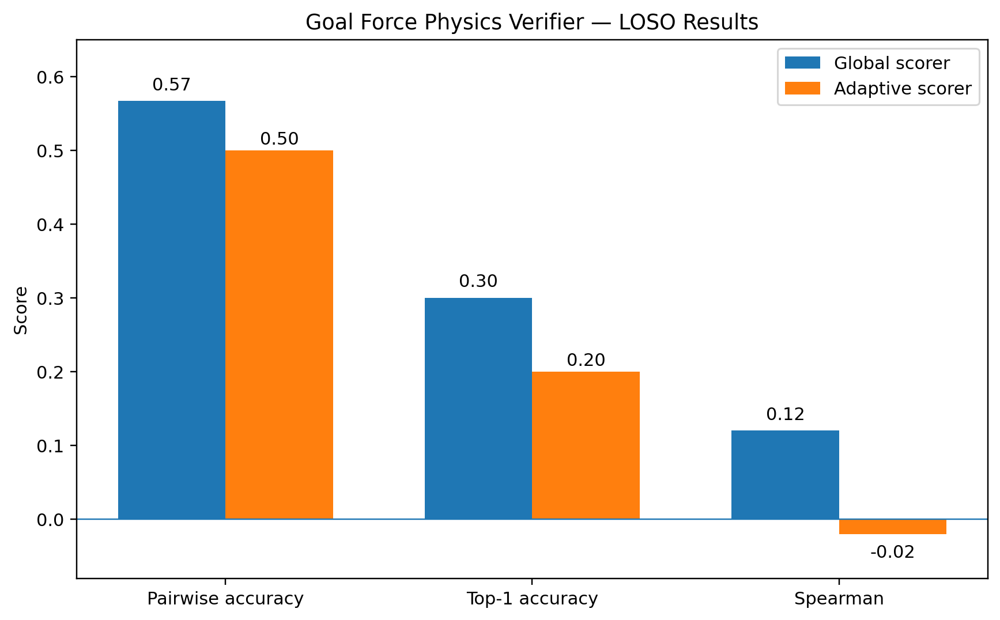

# Goal Force Physics Verifier

A physics-aware reranking pipeline for videos generated by [Goal Force](https://github.com/brown-palm/goal-force).

This project asks a simple question:

> Can lightweight, interpretable physics metrics help select the most physically plausible Goal Force generation from several candidate videos?

The answer, at least in this small experiment, is **partially**. The verifier captures useful signal in some interaction types, but a single global linear scorer does not generalize reliably across heterogeneous physical scenarios.

## Overview

The pipeline:

```text
Goal Force candidate videos
        ↓
SAM2 + CoTracker + RAFT
        ↓
object masks + trajectories + optical flow
        ↓
physics-aware metrics
        ↓
weighted verifier score
        ↓
candidate reranking
```

For each scenario, Goal Force generates four candidates using seeds `5, 6, 7, 8`.

Each candidate is evaluated using interpretable signals including:

* goal completion
* direction alignment
* contact causality
* motion stability
* optical-flow consistency
* collision-specific diagnostics where applicable

Human rankings provide the reference ordering.

## Dataset

The experiment contains:

* **12 scenarios**
* **4 candidates per scenario**
* **48 generated videos**
* **10 development scenarios**
* **2 untouched final-test scenarios**

### Development scenarios

```text
ball_dominos
pendulum
pool
bulb
cantaloupes
tennis
golf
toycar
paw_tool1
paw_tool2
```

### Final test scenarios

```text
soccer
paw_tool3
```

The two test scenarios were kept out of metric development and scorer fitting.

## Feature Extraction

Each video is processed using three complementary vision systems:

### SAM2

Segments the relevant physical objects throughout the video.

### CoTracker

Tracks sparse points attached to those objects across time.

### RAFT

Computes dense frame-to-frame optical flow.

Together these provide estimates of object position, displacement, interaction timing, trajectory consistency, and motion quality.

## Interaction Types

The scenarios are heterogeneous, so metric extraction distinguishes several forms of interaction:

```text
collision
strike
direct_actuation
single_target
```

Examples:

* `pool`, `tennis` → collision
* `pendulum`, `golf` → strike
* `bulb`, `paw_tool1` → direct actuation
* `toycar` → single target

Metrics that are not physically meaningful for a scenario are excluded rather than fabricated.

## Physics Metrics

The primary verifier uses five normalized metrics:

```text
goal_completion
direction_alignment
contact_causality
motion_stability
flow_consistency
```

Metrics are min-max normalized **within each scenario**, since absolute motion scales differ substantially across scenes.

The scorer is constrained to nonnegative weights summing to one.

## Evaluation

### Leave-One-Scenario-Out

The primary development evaluation uses **Leave-One-Scenario-Out (LOSO)** cross-validation.

For each of the 10 development scenarios:

1. hold out one complete scenario,
2. fit weights on the other nine,
3. evaluate on the unseen scenario,
4. repeat for all scenarios.

This tests generalization across scenarios rather than merely across random seeds.



### Global scorer results

Mean LOSO performance:

| Metric                            |    Result |
| --------------------------------- | --------: |
| Pairwise accuracy                 | **56.7%** |
| Spearman correlation              |  **0.12** |
| Kendall correlation               |  **0.13** |
| Top-1 accuracy                    |   **30%** |
| Mean rank improvement over seed 5 | **-0.10** |

The final development-all weights were:

| Metric              | Weight |
| ------------------- | -----: |
| Goal completion     |   0.30 |
| Direction alignment |   0.10 |
| Contact causality   |   0.30 |
| Motion stability    |   0.30 |
| Flow consistency    |   0.00 |

The scorer performs strongly on some scenarios, including `tennis`, `golf`, and `paw_tool1`, but fails to transfer reliably to others.

## Untouched Final Test

After freezing the metric extractor and global weights, the verifier was evaluated once on:

```text
soccer
paw_tool3
```

Results:

| Metric                            |    Result |
| --------------------------------- | --------: |
| Pairwise accuracy                 | **58.3%** |
| Spearman correlation              |  **0.10** |
| Kendall correlation               |  **0.17** |
| Top-1 accuracy                    |   **50%** |
| Mean rank improvement over seed 5 |   **0.0** |

The verifier correctly selected the human-best candidate for `soccer`, improving two ranking positions over seed 5.

It failed on `paw_tool3`, selecting the human third-ranked candidate while seed 5 was already human-best.

The final test therefore broadly matches the development finding: the metrics contain signal, but the global scorer is not consistently reliable.

## Adaptive Scoring Experiment

A natural follow-up hypothesis was that different physical interaction types require different metric weights.

An exploratory scorer therefore learned separate weights for:

```text
collision
strike
direct_actuation
single_target
```

This did **not** improve generalization.

| Metric                     | Global LOSO | Adaptive LOSO |
| -------------------------- | ----------: | ------------: |
| Pairwise accuracy          |   **56.7%** |         50.0% |
| Spearman                   |    **0.12** |         -0.02 |
| Kendall                    |    **0.13** |          0.00 |
| Top-1 accuracy             |     **30%** |           20% |
| Rank improvement vs seed 5 |   **-0.10** |         -0.20 |

The likely limitation is sample size. Several interaction classes contain only one or two independent training scenarios.

The adaptive experiment is therefore treated as exploratory rather than as a validated improvement.

## Main Finding

The central result is negative but informative.

Interpretable physics signals can help distinguish Goal Force candidates, but a single linear physics scorer does not robustly generalize across heterogeneous physical interactions.

The experiment also suggests that simply fitting separate weights by interaction type is insufficient with the current amount of data.

This points toward richer approaches such as:

* larger and more diverse scenario sets,
* learned interaction representations,
* scenario-conditioned verification,
* nonlinear combinations of physics signals,
* explicit causal or event-structured physical reasoning.

## Repository Structure

```text
.
├── data/
│   ├── train/
│   ├── test/
│   └── rankings.csv
├── features/
├── test_features/
├── results/
│   ├── metrics.csv
│   ├── evaluation.csv
│   ├── weights.csv
│   ├── scorer_config.json
│   ├── final_test_evaluation.csv
│   ├── adaptive_evaluation.csv
│   └── adaptive_scorer_config.json
└── src/
    ├── extract_metrics.py
    ├── fit_scorer.py
    ├── fit_scorer_adaptive.py
    └── evaluate_test.py
```

Large generated videos and extracted features are excluded from Git by default.

## Running the Scorer

Assuming features have already been extracted:

```bash
python src/extract_metrics.py \
  --features features \
  --output results/metrics.csv
```

Fit and evaluate the global scorer:

```bash
python src/fit_scorer.py \
  --metrics results/metrics.csv \
  --rankings data/rankings.csv \
  --output results
```

Run the exploratory interaction-conditioned scorer:

```bash
python src/fit_scorer_adaptive.py \
  --metrics results/metrics.csv \
  --rankings data/rankings.csv \
  --output results
```

Evaluate the frozen scorer on the final test set:

```bash
python src/evaluate_test.py
```

## Limitations

This is a small exploratory study.

In particular:

* only 12 independent scenarios are available,
* interaction classes are highly imbalanced,
* human rankings were produced by a single evaluator,
* several metrics depend on the quality of segmentation and tracking,
* the scorer is deliberately simple and linear,
* Goal Force scenarios span substantially different kinds of physical interaction.

The reported numbers should therefore be interpreted as evidence about this experimental setup, not as a general benchmark for physical video understanding.

## Acknowledgments

This project builds on **Goal Force** from Brown University's PALM Lab.

Goal Force and its original authors deserve full credit for the underlying video-generation model, scenarios, and research direction. This repository is an independent experimental extension focused on physics-aware candidate verification and reranking.

## Status

This project is a research prototype.

The current experiment is frozen so that the development and final-test results remain reproducible. Future work should extend the scenario set rather than continue tuning against the existing evaluation examples.
